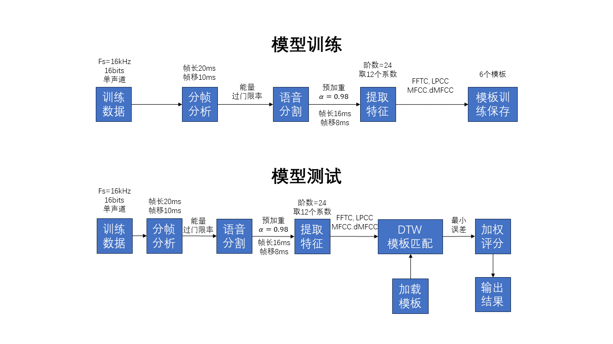

# DTW-Speech-Cognition
Homework of the course 'Speech Signal Process'. Able to recoginize the number from 0 to 9 in Chinese.

* \data：Conclude test datas and train datas
* block.m：Split the speech signal
* cepstrum.m：Feature extraction. Outputs: LPCC, MFCC, dMFCC, FFTC
* DP.m：DTW implenmentation
* durbin.m：Durbin algorithm
* featuredata.mat：template datas, generates after training
* main.m：

>  语音数字串识别器：利用传统语音识别算法，在MATLAB上实现在普通实验室噪声环境下对0-9数字串的语音识别。

* 模型训练

  * 训练数据由手机软件采集，采集参数为16000采样率，16bits，单声道，线性PCM，wav文件，数据内容是在图书馆环境下的间断0-9数字语音。

  * 分帧分析：帧长为20ms，帧移为10ms，对每一帧计算过门限率与能量，门限设置为语音始末阶段最大噪声功率的2倍。通过过门限率与能量特征对语音进行分割，获得0-9共10个语音序列。对每个语音序列预加重，加重滤波器的一阶LPC系数为$\alpha_1=0.98$，然后分帧分析，帧长16ms，帧移8ms。

  * 特征提取：对每帧提取四种特征参数：LPCC, FFTC, MFCC, dMFCC，提取参数时设置算法阶数均为24，取第2值13位共12个作为语音特征。

  * 模板训练保存：对每个语音的每一帧的四个特征参数进行DTW模板训练，设置初始模板为6个。模板距离度量为欧氏距离度量。训练完毕保存模板聚类中心数据。

* 模型测试

  * 测试数据通过matlab函数采集，采集参数为16000采样率，16bits，单声道。后面的分帧分析、语音分割、提取特征步骤同模型训练。

  * 特征提取完毕后加载已保存的模板数据，对测试数据进行DTW模板匹配，模板距离度量为欧氏距离度量。输出0-9各个4种特征参数的最小误差。

  * 根据四种参数的最小误差的方差值，赋予该种特征参数的可信度，根据可信度对四种参数的预测结果进行加权评分，最终输出得分最高的数字。
